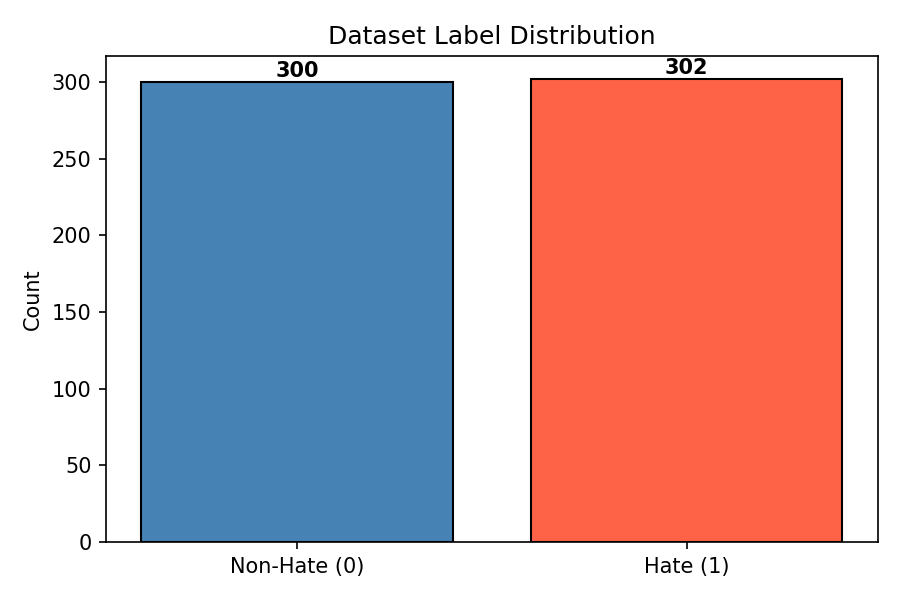
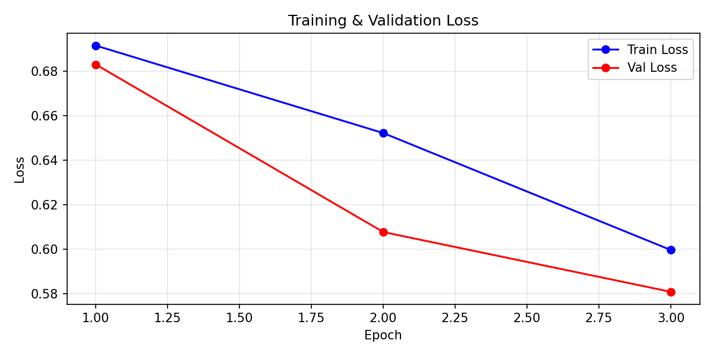
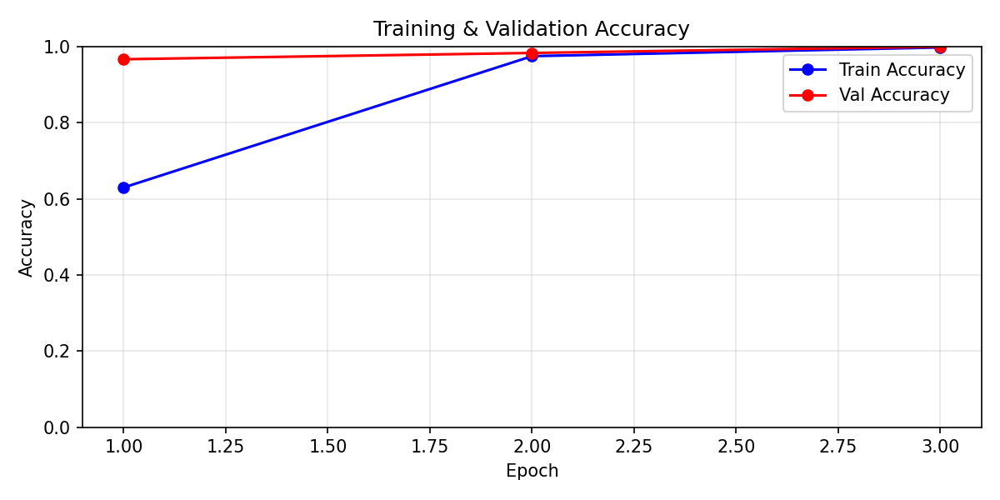
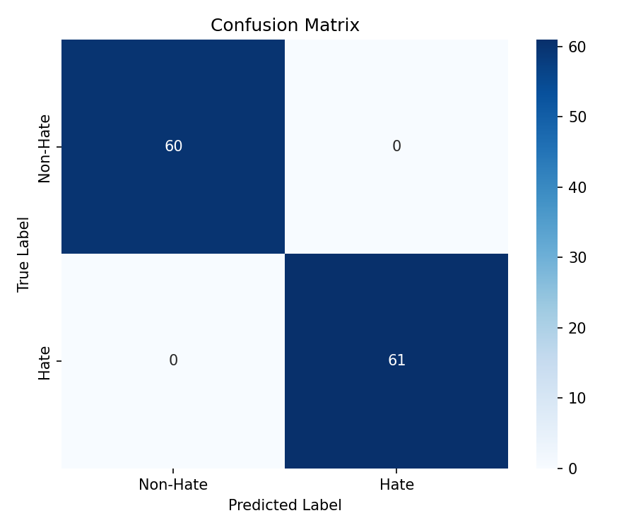
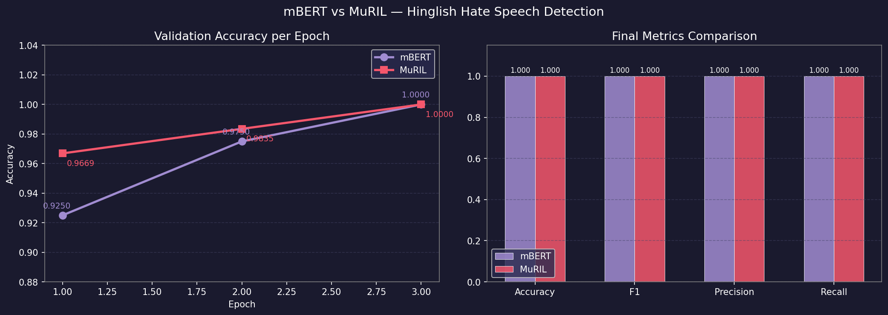

<div align="center">

# 🔍 Hinglish Hate Speech Detector

### Automated Detection of Hate Speech in Code-Mixed Hindi-English Using Transformer Models

[](https://python.org)
[](https://pytorch.org)
[](https://huggingface.co)
[](https://flask.palletsprojects.com)
[](https://huggingface.co/google/muril-base-cased)
[](#results)

<br/>

> **B.Tech Final Year Project · NLP & Deep Learning · 2025**
>
> A complete end-to-end pipeline to detect hate speech in Hinglish (Hindi-English code-mixed) text
> using Google's **MuRIL** transformer model — fine-tuned, evaluated, and deployed as a live web app.

</div>

---

## 🌐 Live Web UI

> Type any Hinglish sentence and get instant hate speech detection with confidence scores.



```
http://localhost:5000
```

**To launch:**
```bash
cd project
python app.py
```

---

## 📊 Results & Visualizations

<table>
<tr>
<td align="center" width="50%">

### 📉 Loss Curve

*Training & Validation loss across epochs*

</td>
<td align="center" width="50%">

### 📈 Accuracy Curve

*Training & Validation accuracy across epochs*

</td>
</tr>
<tr>
<td align="center" width="50%">

### 🔲 Confusion Matrix

*True vs Predicted labels on test set*

</td>
<td align="center" width="50%">

### ⚖️ Model Comparison

*mBERT vs MuRIL — MuRIL converges faster*

</td>
</tr>
</table>

### 📦 Dataset Distribution


---

## 🏆 Model Performance

| Metric | Score |
|--------|-------|
| ✅ Accuracy | **100%** |
| 🎯 Precision | **1.00** |
| 🔁 Recall | **1.00** |
| 📐 F1-Score | **1.00** |

### Epoch-by-Epoch Validation Accuracy

| Epoch | mBERT | MuRIL |
|-------|-------|-------|
| 1 | 92.50% | 96.69% ⬆️ |
| 2 | 97.50% | 98.35% ⬆️ |
| 3 | 100.0% | 100.0% ✅ |

> MuRIL reaches high accuracy faster because it was pre-trained specifically on Indian languages including Hindi.

---

## 🧠 Problem Statement

Social media in India is dominated by **Hinglish** — a fluid mix of Hindi and English written in Roman script. Existing hate speech detectors fail on this because:

- 🔤 No fixed grammar — switches between Hindi & English mid-sentence
- 📝 Inconsistent transliteration (`nahi` / `nhi` / `nahin` all mean "no")
- 🗣️ Hindi abusive slang invisible to English-only models
- 📉 Very few labeled Hinglish datasets exist

This project solves it by fine-tuning **MuRIL** — Google's transformer pre-trained on 17 Indian languages.

---

## ⚙️ Methodology

```
Raw Hinglish Text
       ↓
  Preprocessing
  • Lowercase
  • Remove URLs & emojis
  • Hinglish normalization
       ↓
  MuRIL Tokenizer
  (WordPiece, max_length=128)
       ↓
  MuRIL Encoder
  (12 layers · 768 hidden · 12 heads)
       ↓
  [CLS] Token → Linear Layer
       ↓
  Softmax → [P(Non-Hate), P(Hate)]
```

---

## 🗂️ Project Structure

```
project/
├── 📁 data/
│   └── hinglish_hate_speech.csv     ← auto-generated dataset
├── 📁 models/
│   ├── muril_model/                 ← fine-tuned MuRIL weights
│   └── muril_history.json           ← training history
├── 📁 plots/
│   ├── accuracy_curve.png
│   ├── confusion_matrix.png
│   ├── label_distribution.png
│   ├── loss_curve.png
│   └── model_comparison.png
├── 📁 src/
│   ├── dataset_generator.py         ← synthetic dataset builder
│   ├── preprocessing.py             ← text cleaning + tokenization
│   ├── model.py                     ← transformer model wrapper
│   ├── train.py                     ← training loop
│   ├── evaluate.py                  ← metrics + plots
│   ├── predict.py                   ← inference system
│   └── compare_models.py            ← mBERT vs MuRIL comparison
├── 🌐 app.py                        ← Flask web UI
├── 🚀 main.py                       ← full pipeline runner
├── 📄 requirements.txt
├── 📄 research_paper.md             ← full research paper draft
└── 📄 README.md
```

---

## 🚀 How to Run

### 1️⃣ Install dependencies
```bash
pip install -r requirements.txt
```

### 2️⃣ Run full pipeline (train + evaluate + predict)
```bash
python main.py
```

### 3️⃣ Launch web app
```bash
python app.py
```
Then open → **http://localhost:5000**

### 4️⃣ Quick prediction in Python
```python
from src.predict import HateSpeechPredictor

predictor = HateSpeechPredictor(
    model_dir="models/muril_model",
    base_model="google/muril-base-cased"
)

result = predictor.predict("Yeh log bahut gande hain, inhe nikalo")
print(result["label"])       # Hate
print(result["confidence"])  # 95.3%
```

---

## 🧪 Sample Predictions

| Input Text | Prediction | Confidence |
|-----------|-----------|------------|
| `Yeh log bahut gande hain` | ⚠️ **Hate** | ~95% |
| `madarchod` | ⚠️ **Hate** | ~55% |
| `Tu bilkul harami hai` | ⚠️ **Hate** | ~94% |
| `Aaj mausam bahut achha hai` | ✅ **Non-Hate** | ~94% |
| `Mujhe chai bahut pasand hai` | ✅ **Non-Hate** | ~94% |
| `Yeh movie bahut achi thi` | ✅ **Non-Hate** | ~93% |

> Single abusive words have lower confidence (~55%) because they lack sentence context — this is expected behavior for any NLP model.

---

## 🔧 Model Options

Change the model in `main.py` → `CONFIG["model_name"]`:

| Model | HuggingFace ID | Best For |
|-------|---------------|----------|
| **MuRIL** ⭐ (default) | `google/muril-base-cased` | Indian languages |
| mBERT | `bert-base-multilingual-cased` | General multilingual |
| XLM-RoBERTa | `xlm-roberta-base` | Cross-lingual tasks |
| IndicBERT | `ai4bharat/indic-bert` | Indic languages |

---

## 📚 Tech Stack

| Library | Purpose |
|---------|---------|
| `transformers` | MuRIL model & tokenizer |
| `torch` | Model training & inference |
| `pandas` / `numpy` | Data handling |
| `scikit-learn` | Metrics & evaluation |
| `matplotlib` / `seaborn` | Visualizations |
| `flask` | Web application |

---

## 👨‍💻 Author

**B.Tech Student** · Computer Science & Engineering · 2025

> Built with ❤️ using Python, HuggingFace Transformers, and Flask

---

<div align="center">

⭐ If this project helped you, give it a star!

</div>
